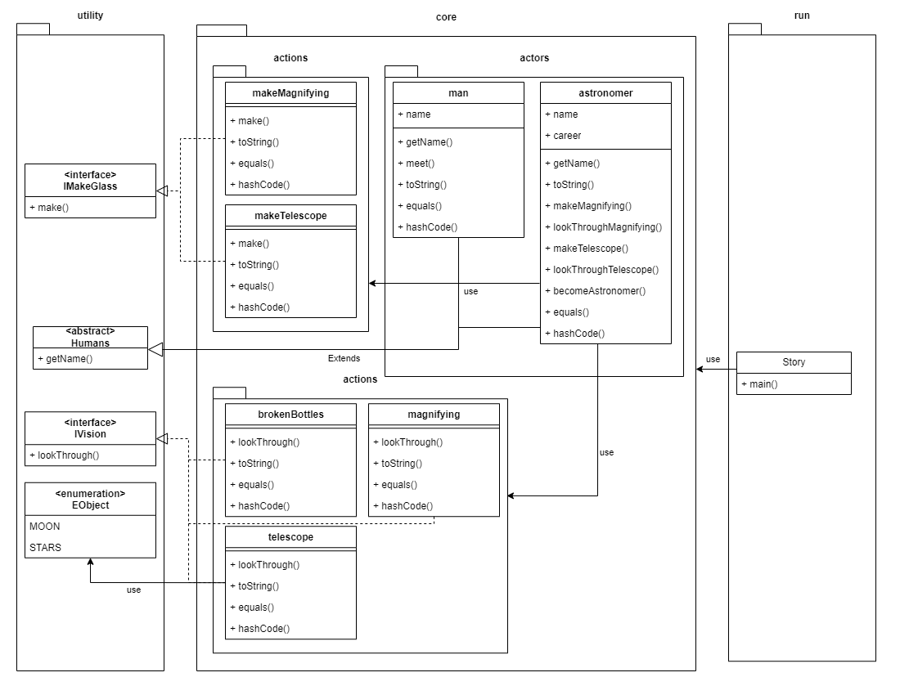

# ProgrammingLab3
## Story
Он пошел домой и встретил знакомого, которого звали Стекляшкин. Этот Стекляшкин был знаменитый астроном. Он умел делать из осколков битых бутылок увеличительные стекла. Когда он смотрел в увеличительные стекла на разные предметы, то предметы казались больше. Из нескольких таких увеличительных стекол Стекляшкин сделал большую подзорную трубу, в которую можно было смотреть на Луну и на звезды. Таким образом он сделался астрономом.

He went home and met an acquaintance named Steklyashkin. This Steklyashkin was a famous astronomer. He knew how to make magnifying glasses from fragments of broken bottles. When he looked through magnifying glasses at different objects, the objects seemed larger. From several such magnifying glasses, Steklyashkin made a large telescope through which one could look at the moon and at the stars. Thus he became an astronomer.

## Class diagram

